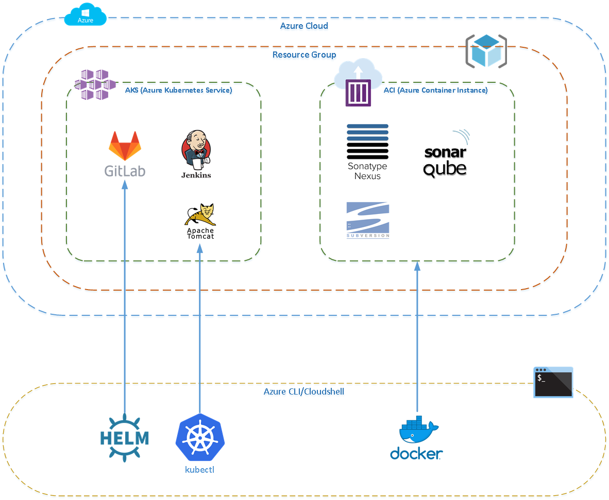
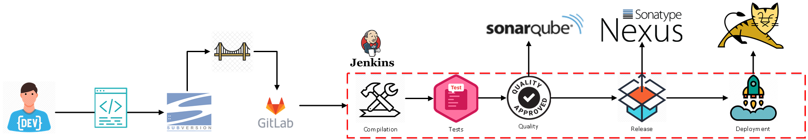
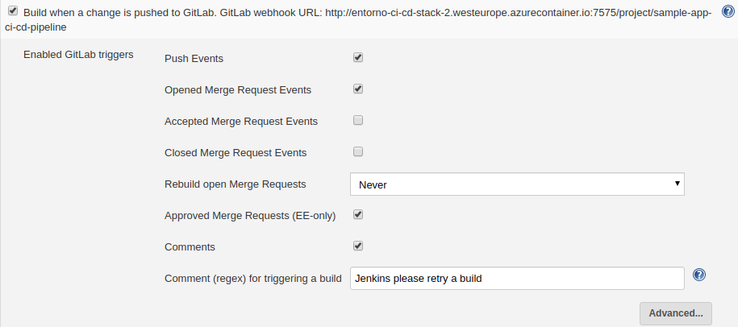
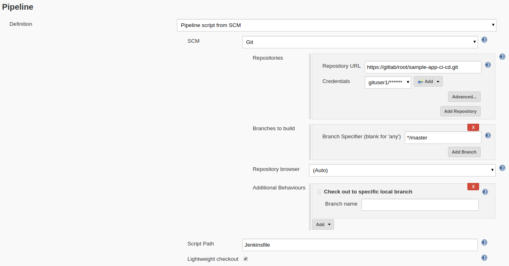
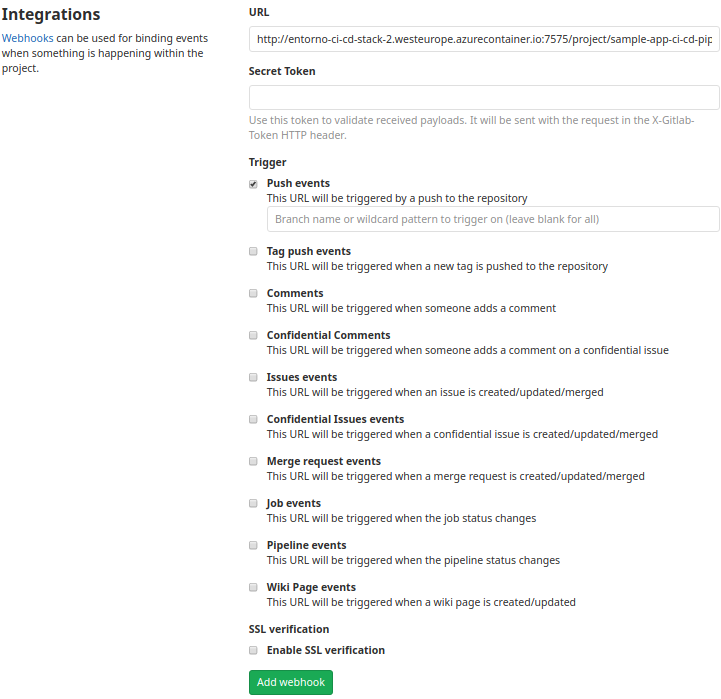

# Azure AKS ACI DevOps

## Overview

`azure-aks-aci-devops` is a Proof of Concept project which demonstrates typical modern DevOps practices for both Development and Operations teams.

## System Architecture

### System Architecture diagram

### Learning concepts

The project provides the following learning concepts for an operations team:

+ Creation of infrastructure in the Microsoft Azure Cloud using the Azure CLI
+ Creation of a multi-code Kubernetes cluster using Microsoft AKS (Azure Kubernetes Service)
+ Creation of a multiple Microsoft ACI (Azure Container Instance) instances
+ Kubernetes deployment of Github server using Helm
+ Kubernetes deployment of Jenkins and Tomcat servers using Kubernetes deployment manifests
+ Deployment of Docker containers to Microsoft ACI

## Development DevOps processes

### DevOps pipeline diagram

### Learning concepts

The project provides the following learning concepts for a development team:

+ Creation of DevOps Continuous Integration pipeline
+ Source code management with Gitlab and Subversion
+ Creation of a synchronization bridge between Gitlab and Subversion
+ Continuous Integration with Jenkins
+ Continuous Inspection with Sonarqube
+ Continuous Deployment to Tomcat server
+ Maven releases and snapshot releases to Nexus

## Quickstart

Follow the step below to get started.

1. Log on to [Azure Portal](https://portal.azure.com/)
2. Connect to the [Azure Cloud Shell Bash](https://azure.microsoft.com/en-us/features/cloud-shell/) environment
3. At the Cloud Shell prompt, clone the `git` project

    `git clone --progress --verbose https://bitbucket.org/damianmcdonald/azure-aks-aci-devops azure-aks-aci-devops`

4. Navigate to the cloned project directory

    `cd azure-aks-aci-devops`

5. Execute the script below to create the project infrastructure in Azure

    `./create-devops-poc.sh`

## Environment information

Following the completion of the [create-devops-poc.sh](https://bitbucket.org/damianmcdonald/azure-aks-aci-devops/src/master/create-devops-poc.sh) script, a new file will be created in the root of the project called `ENV-INFO.txt`.

This `ENV-INFO.txt` contains all of the relevant details about the environment such as:
* Azure location
* Private DNS Zone information
* AKS cluster name
* ACI details
* Server Urls
* Server access credentials

## Environment management

Following the completion of the [create-devops-poc.sh](https://bitbucket.org/damianmcdonald/azure-aks-aci-devops/src/master/create-devops-poc.sh) script, several new scripts will have been created to help you to manage the PoC environment in Azure.

Location | Purpose
------------ | -------------
create-devops-poc.sh | Creates the PoC infrastructure - do not re-run this if you already have created the PoC in Azure
destroy-devops-poc.sh | Destroys the PoC infrastructure - this will remove all the paid resources that were created by the PoC. WARNING - all data created by the PoC will be lost
aks-clusters/create-aks-cluster.sh | Creates the AKS cluster - do not re-run this if you already have created the AKS cluster in Azure
aks-clusters/destroy-aks-cluster.sh | Destroys the AKS cluster - this will remove the AKS cluster. WARNING - all data created by the AKS cluster will be lost
aks-clusters/start-aks-cluster.sh | Starts the AKS cluster by requesting Virtual Machine resources
aks-clusters/stops-aks-cluster.sh | Stops the AKS cluster by deallocating the Virtual Machines
container-instances/create-container-instance.sh | Creates the ACI instances - do not re-run this if you already have created the ACI instances in Azure
container-instances/destroy-container-instance.sh | Destroys the ACI instances - this will remove the ACI instances. WARNING - all data created by the ACI instances will be lost
container-instances/start-container-instance.sh | Starts the ACI instances
container-instances/stop-container-instance.sh | Stops the ACI instances

## Configuring the servers

### Gitlab

1. Naviagte to http://${AZURE_GITLAB_IP}
2. On first boot, you must select a password for the `root` user.
3. After adding the `root` password, you will be redirected to the Gitlab login package
4. Login as username: `root` using the new password that you selected
5. After logon, navigate to http://${AZURE_GITLAB_IP}/admin
6. Select `New User` and enter the following detail for the user:
    * Name: `Git User 1`
    * Username: `gituser1`
    * Email: `gituser1@${POC_DNS_ZONE}`
    * Click `Create User`
    * Click `Edit`
    * Enter and confirm password
    * Click `Save Changes`

1. Create a new CI CD project; http://${AZURE_GITLAB_IP}/projects/new
    * Enter Project Name: `sample-app-ci-cd`
    * Set Visibility Level: `Public`
    * Click `Create Project`
    * Click `Settings` -> `Members`
    * Enter Git Lab Member: `gituser1`
    * Choose a role permission: `Maintainer`
    * Click `Add to project`

2. Create a new CI CD project; http://${AZURE_GITLAB_IP}/projects/new
    * Enter Project Name: `sample-app-svn-git`
    * Set Visibility Level: `Public`
    * Click `Create Project`
    * Click `Settings` -> `Members`
    * Enter Git Lab Member: `gituser1`
    * Choose a role permission: `Maintainer`
    * Click `Add to project`

## Jenkins

### Initial configuration

Execute the following command using [Azure Cloudshell](https://azure.microsoft.com/en-us/features/cloud-shell/) to get the Jenkins admin password which you will need for first time access:

  `az container logs --resource-group entorno-ci-cd-rg --name entorno-ci-cd-stack-2`

1. Navigate to http://${AZURE_JENKINS_IP}:7575
2. Enter the auto-generated password and click `Continue`
3. On the Customize Jenkins screen, select the option `Install suggested plugins`
4. Create First Admin User with the following details:
    * Username: `root`
    * Password: `ADD_PREFERRED_PASSWORD`
    * Full name: `Root User`
    * Email: `jenkins-user@${POC_DNS_ZONE}`
    * Click `Save and Continue`
5. At `Instance Configuration` select `Save and Finish`
6. Click `Start using Jenkins`

### Define JDK and Maven

1. Navigate to http://${AZURE_JENKINS_IP}:7575/configureTools/
2. In section `JDK`, select `Add JDK`
    * Uncheck `Install automatically`
    * Name: `Java8`
    * JAVA_HOME: `/opt/java`
3. Click `Apply`

1. In section `Maven`, select `Add Maven`
    * Uncheck `Install automatically`
    * Name: `Maven3`
    * MAVEN_HOME: `/opt/maven`
2. Click `Save`

### Install Gitlab plugins in Jenkins

1. Navigate to Jenkins; http://${AZURE_JENKINS_IP}:7575/pluginManager/
2. Logon as `root`
3. Click `Available` tab and filter for `Gitlab`
4. Select the following plugins and click `Install without restart`
    * `Gitlab`
    * `Gitlab Hook`

## Nexus

### Initial configuration

Execute the following command using [Azure Cloudshell](https://azure.microsoft.com/en-us/features/cloud-shell/) to get the Nexus admin password which you will need for first time access:

  `az container exec -g ${RESOURECE_GROUP} --name ${CONTAINTER_GROUP} --container-name nexus --exec-command "/bin/sh"`
  `cat /nexus-data/admin.password`

1. Navigate to http://${AZURE_NEXUS_IP}:8081/
2. Click the `Sign In` button
3. Enter `Username` as `admin`
4. Enter `Password` as retrieved from the container console
5. Follow the steps to the setup wizard
6. Set the password
7. Check the `Enable anonymous access` option

### Create a deployer user account

1. Navigate to http://${AZURE_NEXUS_IP}:8081/#admin/repository
2. Click on `Security` -> `Users`
3. Click the `Create local user` button
    * Add `ID` as `deployer`
    * `First name:` as `Deployment`
    * `Last name:` as `User`
    * `Email:` as `deployer@${POC_DNS_ZONE}`
    * `Password` as `ADD_PREFERRED_PASSWORD`
    * `Roles` -> `nx-admin` -> `Granted`
    * Click `Create local user`

## Create Gitlab - Jenkins Integration

### Create Personal Access Token in Gitlab

1. Navigate to Gitlab; https://${AZURE_GITLAB_IP}
2. Logon as `gituser1`
3. Navigate to https://${AZURE_GITLAB_IP}/profile/personal_access_tokens
4. Enter `Name`; `Jenkins-Access-Token`
5. Enable `Scopes` -> `api`
6. Click `Create personal access token`
7. Copy the `New Personal Access Token`

## Configure Gitlab integration in Jenkins

1. Navigate to Jenkins; http://${AZURE_JENKINS_IP}:7575/configure
2. In the `Gitlab` section
    * Uncheck `Enable authentication for '/project' end-point`
    * Enter `Connection Name`: `Gitlab`
    * Enter `Gitlab host URL`: `https://${AZURE_GITLAB_IP}`
    *  `Credentials` -> `Add` -> `Jenkins`
        * `Kind` -> `Gitlab API token`
        * Paste into `API token` the personal access token created earlier in Gitlab
        * Enter `ID` : `Gitlab-CI-CD`
        * Click `Àdd`
    * In `Credentials` choose `Gitlab API token`
3. Click `Advanced`
4. Check `Ignore SSL Certificate Errors`
5. Verify connection using `Test Connection`
6. In the `Git plugin` section
    * Set `Global Config user.name Value` to `gituser1`
    * Set `	Global Config user.email Value` to `gituser1@${POC_DNS_ZONE}`
7. Click `Save`

## Configure Jenkins pipeline for project `sample-app-ci-cd`

1. Navigate to http://${AZURE_JENKINS_IP}:7575/newJob
2. Enter item name; `sample-app-ci-cd-pipeline`
3. Choose `Pipeline`
4. Click `OK`
5. Ensure that `Gitlab Connection` is set to `Gitlab`
6. In `Build Triggers`, select `Build when a change is pushed to Gitlab` and configure settings as shown below.

7. In `Pipeline` configure the settings as below:

8. In `Repositories`add the `Repository URL` : `https://${AZURE_GITLAB_IP}/root/sample-app-ci-cd.git`
9. In `Repositories` add credentials for the `gituser1`
    * Username: `gituser1`
    * Password: `ADD_PREFERRED_PASSWORD`
10. Set `Script Path` as `Jenkinsfile`
11. Add `Additional Behaviours` -> `Check out to specific local branch` (leave the `Branch name` empty)
12. Click `Save` button

### Configure Jenkins webhook in Gitlab

1. Navigate to https://${AZURE_GITLAB_IP}/root/sample-app-ci-cd/-/settings/integrations
2. In the `URL` section enter `http://${AZURE_JENKINS_IP}:7575/project/sample-app-ci-cd-pipeline`
3. Uncheck `Enable SSL verification`
4. Click `Add webhook`
5. Navigate to https://${AZURE_GITLAB_IP}/root/sample-app-ci-cd/-/settings/ci_cd
6. Uncheck `Default to Auto DevOps pipeline`
7. Click `Save changes`

# Test the stack

* [Perform a full release pipeline with sample-app-ci-cd](sample-apps/sample-app-ci-cd)
* [Verify the SVN - GIT synchronization bridge with sample-app-svn-git](sample-apps/sample-app-svn-git)
